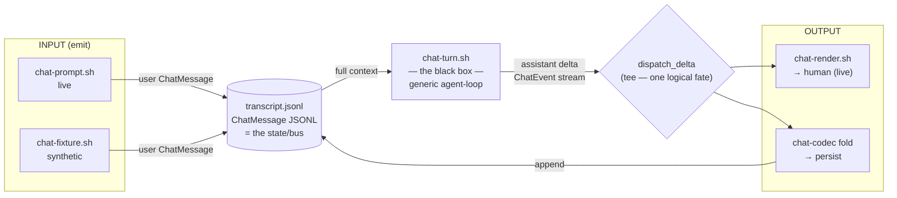
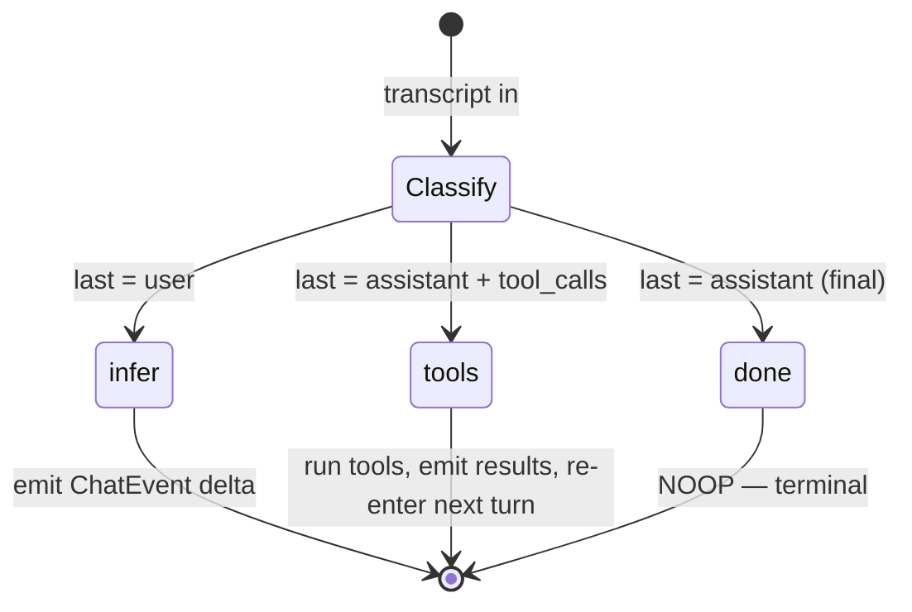
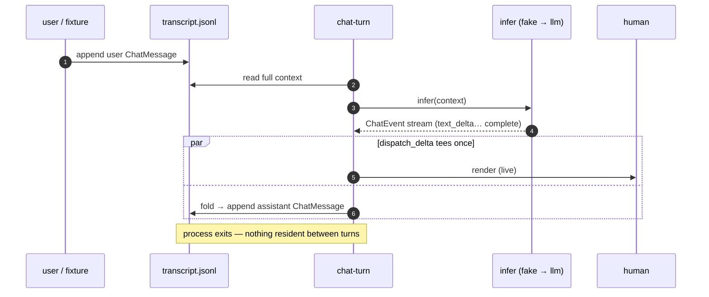

# `chat` — Application Circuit Datasheet

The chat turn as a **circuit**: logical components wired in the shell, each a physical executable (`chat-codec`, `chat-render`, `llm`) abstracted behind a logical role so the schematic never couples to invocation syntax. This is the engineering twin of the [README](README.md) — the spec sheet of the part.

> [!WARNING]
> **Correction pending — S449 vision session (not yet folded in).** This datasheet draws the frontend as a symmetric `(emit, render)` pair teed on one circuit. The realization since: the **emit is a decoupled communication client** that does `send(coordinate, signal)` and dies; **write, trigger/routing, and output are three separate transactions** — logically *and* physically, possibly different circuits, asynchronous — with storage and routing abstracted behind the TX coordinate. The chat circuit is the **degenerate case of the universal communication client** between any two entities. The `dispatch_delta` tee stays valid *inside* the processing transaction; it is the emit that detaches. Full signal: `hq/inbox/datasheet-correction-chat-recategorization.md` and `hq/inbox/console-as-communication-client.md` — to be folded in at digestion.

---

## 1. The invariant

Every turn — pure LLM or full agent — is one shape, the same seen from outside and from inside:

```
input ─► [ turn ] ─► output
```

The black box *grows inside* (an agent adds an internal loop, tools, context management) but the skeleton never changes. Every logical component lives on one of the three axes — **input · turn · output** — which is also the coordinate system: you always know which stage a part belongs to.

**Operating characteristics** (true of every component, the circuit's "electricals"):

| property | meaning |
|---|---|
| **stateless** | `f(in) → out`; continuity lives *outside*, in the transcript handed in — no part is resident |
| **event-driven** | nothing runs until a stimulus arrives; between events there is no process |
| **burstable** | tiny duty cycle, wall-clock dominated by waiting; a brief compute flare per event |

---

## 2. Block diagram



`chat.sh` is this diagram, top to bottom. The transcript is the bus every stage reads or writes; the components never speak to each other directly.

---

## 3. Pinout

Each component's "pins" are its process contract: `argv`, `stdin`, `stdout`, `stderr`, exit. The schematic depends only on these — the body behind them is swappable.

### `chat-prompt.sh` — INPUT (live)
| pin | dir | signal |
|---|---|---|
| argv | in | the human utterance (text) |
| stdin | in | utterance, when argv is empty (fixtures pipe in here) |
| stdout | out | one `ChatMessage` JSONL line, `role=user` |

### `chat-fixture.sh` — INPUT (synthetic, the signal generator)
| pin | dir | signal |
|---|---|---|
| argv[0] | in | optional fixture name → `fixtures/<name>.jsonl` |
| stdout | out | canned `ChatMessage` line(s); a default user line if no fixture named |

### `chat-turn.sh` — TURN (the black box)
| pin | dir | signal |
|---|---|---|
| stdin | in | the **full transcript** (`ChatMessage` JSONL) — the context |
| stdout | out | the assistant **delta** as a `ChatEvent` stream (`text_start … text_delta … text_stop · complete`) |
| — | — | emits nothing on the `done` branch (terminal) |

### `chat-render.sh` — OUTPUT
| pin | dir | signal |
|---|---|---|
| stdin | in | a `ChatEvent` stream |
| stdout | out | styled, human-readable text (a thin face over the `chat-render` coreutil) |

### `chat.sh` — the schematic (composition)
| pin | dir | signal |
|---|---|---|
| argv | in | utterance → live input; **absent** → synthetic input |
| `TRANSCRIPT` env | in | path to the transcript bus (default: a fresh temp file) |
| stderr | out | the rendered reply (live) + the transcript path |

---

## 4. The bus — two encodings of one ontology

The wire carries the `ChatInference` ontology at two altitudes; `chat-codec` is the only constructor/transcoder.

- **Transcript (durable state):** `ChatMessage` JSONL — one folded message per line. The append-only degenerate case; one mutation = one line.
  `{"role":"CHAT_ROLE_USER","content":[{"text":{"text":"…"}}]}`
- **Delta (in-flight):** `ChatEvent` stream — the streamed frames of one assistant turn, reduced to a `ChatMessage` by `chat-codec fold`.
  `text_start → text_delta:"…" → text_stop → complete:end_turn`

The turn consumes messages and produces events; `fold` closes the loop back to messages. `chat-render` consumes the same events live — the stream flows **once**, the shell tees it.

---

## 5. The turn's state machine

`chat-turn.sh` advances the conversation by exactly one step. The internal logic is named (`next_state`, `infer`, `run_tools`) so the circuit reads as pure logic.



Termination is structural: the loop ends because the **log shows terminal** (`last = assistant final`), never by a counter. Chat-without-tools is the degenerate machine — only the `infer` and `done` edges exist; the agent is the same machine with `tools` wired. *In this first pass the `tools` branch is stubbed.*

---

## 6. Timing — one turn



Ingest (append user) and process (the state machine) are **separate transactions**: a stimulus is logged in its own breath, then processed. Multi-turn is this sequence wrapped in a shell `while read` — the shell owns the loop.

---

## 7. Swap points (the jumpers)

Where the breadboard is meant to be re-wired, each behind a single logical seam:

| jumper | first pass | production | seam |
|---|---|---|---|
| **infer** | fake deterministic event generator | `llm …` fed the transcript | the `infer()` function body in `chat-turn.sh` — one block |
| **dispatch_delta** | render (live) + fold (persist) | + `tx commit` (journal each step) | the `dispatch_delta()` function in `chat.sh` — one more leg |
| **input** | `chat-fixture.sh` (synthetic) | `chat-prompt.sh` (live) / a GUI `emit` | same `stdout` contract, swap the emitter |
| **persistence** | a temp/flat `transcript.jsonl` | `tx` worktree at `<place>/.tx/bentos.chat.app/<scope>/<thread>` | the transcript path; addressing per the engineering doc §1 |

The real device plugs in **at the edge, last** — the whole circuit is built and proven against fixtures first.

---

## 8. Fixtures — the signal generator

Built by the codec, never hand-written, so they are valid by construction:

| fixture | shape | drives |
|---|---|---|
| `greeting.jsonl` | one `user` message | the `infer` branch |
| `answered.jsonl` | `user` + `assistant` | the `done` branch (terminal → empty output) |

```sh
chat-codec message --user "…"        # construct a user line
chat-codec event text_start text_delta:"…" text_stop complete:end_turn  # a synthetic assistant turn
```

---

*First breadboard pass (S449). Minimal-conceptual: the circuit is nailed end to end; the implementation is not final. Companions: [README](README.md), [engineering doc](../../../../hq/workshop/humanos/apps/chat/engineering.md), [`chat-codec` README](../../docs/coreutils/chat-codec/README.md).*
